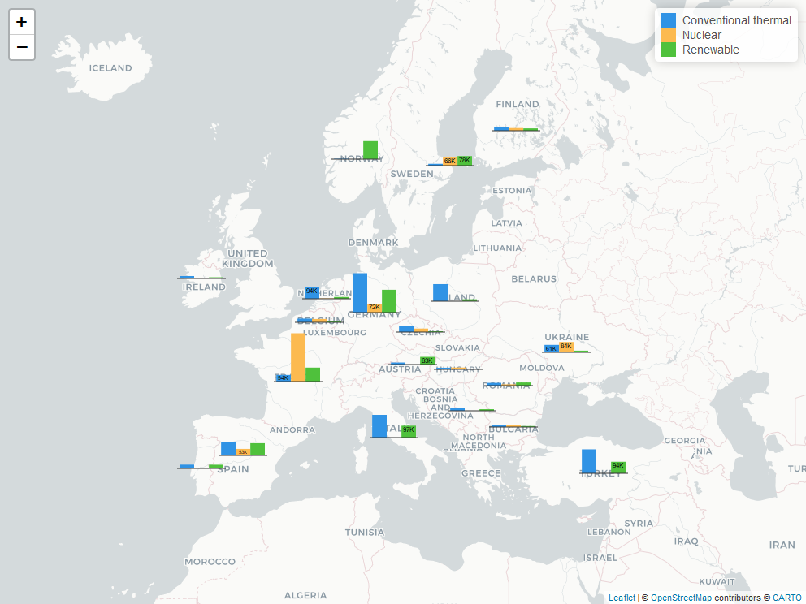

# tidytuesday2020-08-04

TidyTuesday (European Energy, 2020-08-04)
https://github.com/rfordatascience/tidytuesday/blob/master/data/2020/2020-08-04/readme.md

**Top 20 European countries in 2018 based on energy production in GWh (Gigawatt hours)**

See [Interactive Map](https://learnlab.com.hr/TidyTuesday20200804/EUEnergy2018.html). Click on chart to see specific country data. 

Screenshot

